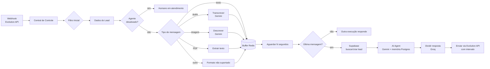

# 🤖 n8n WhatsApp AI Agent

Agente de IA para atendimento no WhatsApp, construído no **n8n**. Ele faz o primeiro atendimento de leads, entende **texto, áudio, imagem e PDF**, mantém memória da conversa, registra o lead no banco e transfere para um humano quando necessário.

O exemplo incluído é a **Fig**, assistente virtual da FigToWeb Studio, que qualifica clientes interessados em landing pages e sites. O prompt pode ser adaptado para qualquer negócio.

## ✨ Funcionalidades

- **Multimodal**: transcreve áudios, descreve imagens (Gemini 2.5 Flash) e extrai texto de PDFs.
- **Buffer de mensagens**: espera o usuário terminar de digitar (padrão: 10s) e responde a todas as mensagens juntas, em vez de uma resposta para cada mensagem.
- **Memória de conversa**: histórico por contato no Postgres.
- **Registro de leads**: cria o lead no Supabase no primeiro contato.
- **Respostas humanizadas**: a resposta é quebrada em mensagens curtas, enviadas com intervalo entre elas.
- **Transferência para humano**: o agente pode se desativar na conversa (por 15 min) para que uma pessoa assuma.
- **Filtros**: ignora grupos, canais, mensagens de sistema e mensagens enviadas por você.

## 🧭 Arquitetura



## 🧱 Stack

| Componente | Uso |
|---|---|
| [n8n](https://n8n.io) (self-hosted, Docker) | Orquestração do fluxo |
| [Evolution API](https://github.com/EvolutionAPI/evolution-api) (self-hosted, Docker) | Conexão com o WhatsApp (recebe webhooks e envia mensagens) |
| Redis | Buffer de mensagens e status do agente por contato |
| Postgres | Memória da conversa (tabela `n8n_chat_histories`, criada automaticamente) |
| Supabase | Cadastro de leads |
| Google Gemini | Modelo do agente, transcrição de áudio e análise de imagem |
| Groq (`openai/gpt-oss-20b`) | Divisão da resposta em mensagens curtas (saída estruturada) |

## 🐳 Infraestrutura auto-hospedada

O n8n e a Evolution API rodam em containers Docker próprios, sem n8n Cloud nem provedores pagos de WhatsApp. Como os dois containers ficam na mesma rede Docker, o n8n acessa a Evolution pelo nome do serviço (`http://evolution_api:8080`), sem expor a API para a internet. Se o seu serviço tiver outro nome ou porta, ajuste `url_evolution` na Central de Controle.

## 🚀 Como usar

### 1. Importar o workflow

No n8n: **Workflows → Import from File** e selecione [`workflow/whatsapp-ai-agent.json`](workflow/whatsapp-ai-agent.json).

### 2. Configurar as credenciais

Ao abrir os nós, selecione ou crie as credenciais:

- **Redis**: nós `Buffer: *`, `Buscar Status do Agente` e `transferir_para_humano`
- **Postgres**: `Memória Postgres`
- **Supabase**: `Encontrar Cliente` e `Criar Cliente`
- **Google Gemini (PaLM) API**: `Google Gemini Chat Model`, `Transcrever Áudio` e `Descrever Imagem`
- **Groq**: `Groq Chat Model`

### 3. Criar a tabela de leads no Supabase

Rode o script [`sql/supabase_leads.sql`](sql/supabase_leads.sql) no SQL Editor do Supabase.

### 4. Ajustar a Central de Controle

O nó **Central de Controle** concentra as variáveis do fluxo:

| Variável | Padrão | Descrição |
|---|---|---|
| `espera_buffer` | `10` | Segundos aguardando novas mensagens antes de responder |
| `temperatura_agente` | `0.5` | Temperatura do modelo do agente |
| `url_evolution` | `http://evolution_api:8080` | URL base da sua Evolution API |

### 5. Conectar a Evolution API

1. Ative o workflow e copie a **Production URL** do nó `Webhook` (path `whatsapp-ai-agent`).
2. Na sua instância da Evolution API, configure essa URL como webhook com o evento `MESSAGES_UPSERT` habilitado.

A instância e a `apikey` usadas para baixar mídias e enviar respostas vêm do próprio payload do webhook, então não é preciso fixá-las no fluxo.

### 6. Personalizar o agente

Edite o **System Message** do nó `AI Agent` para trocar a identidade, o tom de voz e o fluxo de qualificação para o seu negócio. Mantenha os blocos `<ErroFormatoMensagem>`, `<ContextoImagem>` e `<ContextoPDF>`: eles explicam ao agente como interpretar as mídias pré-processadas.

## 🙋 Transferência para humano

Quando o agente usa a ferramenta `transferir_para_humano`, a chave `<numero>_status` recebe o valor `Desativado` no Redis com expiração de **15 minutos** (`ttl: 900`). Enquanto ela existir, o fluxo ignora as mensagens desse contato. Para reativar o agente antes disso, apague a chave no Redis. Para mudar a duração, altere o TTL no nó `transferir_para_humano`.

## 📁 Estrutura

```
.
├── workflow/
│   └── whatsapp-ai-agent.json   # Workflow para importar no n8n
├── sql/
│   └── supabase_leads.sql       # Tabela de leads
└── README.md
```
